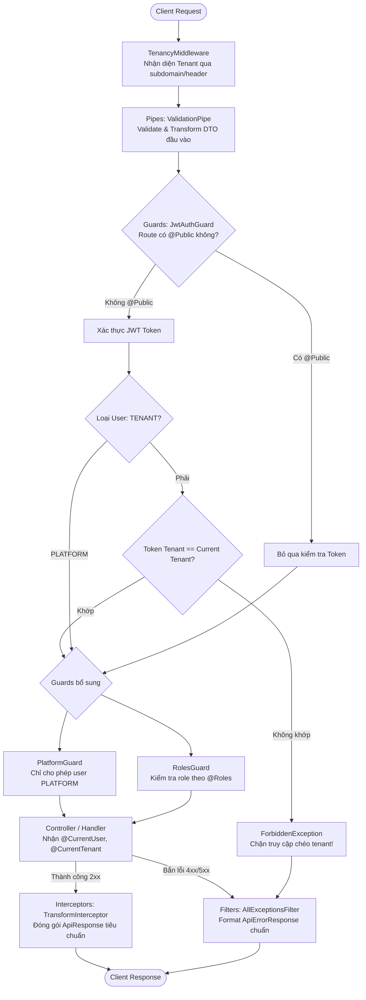

# Kiến Trúc & Vai Trò Các Thành Phần Trong `src/common`

> **Mục đích tài liệu:** Sổ tay tra cứu nhanh kiến trúc, vai trò, cơ chế hoạt động và cách sử dụng các thành phần dùng chung (`src/common`) trong dự án NestJS Multi-tenant SaaS.

---

## 1. Tổng Quan Kiến Trúc (Architecture Overview)

Thư mục [`src/common`](file:///z:/Workspace2026/backend-nestjs-multi-tenant/src/common) là **tầng chia sẻ (Cross-cutting Concerns Layer)**, xử lý các tác vụ xuyên suốt mọi module trong hệ thống:
1. **Xác thực danh tính (Authentication):** Kiểm tra JWT token.
2. **Cô lập Tenant (Tenant Isolation Enforcement):** Ngăn chặn người dùng của công ty này truy cập dữ liệu của công ty khác (chống rò rỉ dữ liệu chéo).
3. **Phân quyền (Authorization & RBAC):** Kiểm tra vai trò của người dùng (`OWNER`, `ADMIN`, `MEMBER`, `SUPER_ADMIN`...).
4. **Chuẩn hóa Request/Response:** DTO Validation (đầu vào) và định dạng Response đồng nhất (đầu ra).
5. **Xử lý ngoại lệ tập trung (Centralized Exception Handling):** Bắt lỗi runtime, lỗi database PostgreSQL và trả về định dạng JSON tiêu chuẩn.

---

## 2. Vòng Đời Của Một HTTP Request (Request Lifecycle)

Khi một HTTP Request được gửi đến máy chủ, nó đi qua các thành phần trong `common` theo thứ tự sau:



---

## 3. Chi Tiết Từng Thành Phần

### 3.1. Decorators (`src/common/decorators`)

Cung cấp các Annotation để khai báo metadata hoặc lấy nhanh dữ liệu ngữ cảnh trong Controller.

| Decorator | Đường dẫn file | Vai trò & Mục đích | Ví dụ sử dụng |
| :--- | :--- | :--- | :--- |
| **`@Public()`** | [`public.decorator.ts`](file:///z:/Workspace2026/backend-nestjs-multi-tenant/src/common/decorators/public.decorator.ts) | Đánh dấu endpoint/controller là công khai. Bỏ qua bước kiểm tra JWT của Guard. | `@Public()`<br>`@Post('login')` |
| **`@Roles(...)`** | [`roles.decorator.ts`](file:///z:/Workspace2026/backend-nestjs-multi-tenant/src/common/decorators/roles.decorator.ts) | Gắn metadata quyền hạn (`AppRole[]`). `RolesGuard` sẽ dựa vào đây để phân quyền. | `@Roles('OWNER', 'ADMIN')`<br>`@Delete(':id')` |
| **`@CurrentUser(...)`** | [`current-user.decorator.ts`](file:///z:/Workspace2026/backend-nestjs-multi-tenant/src/common/decorators/current-user.decorator.ts) | Lấy thông tin user đã đăng nhập từ `req.user`. Có thể trích xuất cả object hoặc 1 trường cụ thể. | `getProfile(@CurrentUser() user)`<br>`getMyId(@CurrentUser('id') id)` |
| **`@CurrentTenant(...)`** | [`tenant.decorator.ts`](file:///z:/Workspace2026/backend-nestjs-multi-tenant/src/common/decorators/tenant.decorator.ts) | Lấy thông tin Tenant hiện tại từ `TenancyContext` (AsyncLocalStorage). | `getTenant(@CurrentTenant() tenant)`<br>`getSchema(@CurrentTenant('schemaName') schema)` |

---

### 3.2. Guards (`src/common/guards`)

Chịu trách nhiệm bảo vệ an toàn cho các API endpoint.

#### 1. [`JwtAuthGuard`](file:///z:/Workspace2026/backend-nestjs-multi-tenant/src/common/guards/jwt-auth.guard.ts)
- **Kế thừa:** `AuthGuard('jwt')` từ `@nestjs/passport`.
- **Cơ chế:**
  1. Kiểm tra nếu route có `@Public()` thì cho qua ngay (`canActivate = true`).
  2. Nếu không, tiến hành giải mã token JWT.
  3. **Quan trọng nhất (Tenant Isolation):** Nếu tài khoản là `TENANT`:
     - Lấy `currentTenant` từ `TenancyContext`.
     - So sánh `authUser.tenantSlug` với `currentTenant.slug`.
     - Nếu khác nhau -> Ném lỗi `ForbiddenException` kèm cảnh báo bảo mật truy cập chéo.

#### 2. [`PlatformGuard`](file:///z:/Workspace2026/backend-nestjs-multi-tenant/src/common/guards/platform.guard.ts)
- **Vai trò:** Bảo vệ các route quản trị hệ thống tầng nền tảng (Platform).
- **Cơ chế:**
  1. Kiểm tra nếu route có `@Public()` thì cho qua.
  2. Bắt buộc `user.type === 'PLATFORM'`. Người dùng thuộc Tenant (`user.type === 'TENANT'`) sẽ bị từ chối truy cập (403 Forbidden).

#### 3. [`RolesGuard`](file:///z:/Workspace2026/backend-nestjs-multi-tenant/src/common/guards/roles.guard.ts)
- **Vai trò:** Kiểm soát truy cập dựa trên vai trò (Role-Based Access Control - RBAC).
- **Cơ chế:**
  1. Nếu route có `@Public()` -> Cho qua.
  2. Đọc danh sách vai trò cho phép từ `@Roles(...)` qua `Reflector`.
  3. Nếu không gắn `@Roles` -> Mặc định cho phép (nếu đã qua `JwtAuthGuard`).
  4. Nếu có gắn `@Roles` -> Kiểm tra xem `user.role` có nằm trong danh sách cho phép không. Nếu không -> Bắn `ForbiddenException`.

---

### 3.3. Interceptors (`src/common/interceptors`)

#### [`TransformInterceptor`](file:///z:/Workspace2026/backend-nestjs-multi-tenant/src/common/interceptors/transform.interceptor.ts)
- Được đăng ký toàn cục tại `main.ts` qua `app.useGlobalInterceptors(new TransformInterceptor())`.
- **Vai trò:** Tự động chuẩn hóa dữ liệu trả về của mọi API thành công (HTTP status 2xx).
- **Định dạng dữ liệu trả về (`ApiResponse<T>`):**
  ```json
  {
    "success": true,
    "statusCode": 200,
    "data": {
      "id": "prod_123",
      "name": "Bánh mì Pate",
      "price": 25000
    },
    "timestamp": "2026-10-06T06:30:00.000Z"
  }
  ```

---

### 3.4. Filters (`src/common/filters`)

#### [`AllExceptionsFilter`](file:///z:/Workspace2026/backend-nestjs-multi-tenant/src/common/filters/all-exceptions.filter.ts)
- Được đăng ký toàn cục tại `main.ts` qua `app.useGlobalFilters(new AllExceptionsFilter())`.
- **Vai trò:** Bắt toàn bộ lỗi (HttpException, Database Error, Unhandled Exception) và format thành JSON đồng nhất.
- **Xử lý đặc biệt các lỗi PostgreSQL:**
  - `23505`: Trùng lặp dữ liệu (Unique constraint violation) -> Đổi thành **`409 Conflict`**.
  - `23503`: Vi phạm khóa ngoại (Foreign key violation) -> Đổi thành **`400 Bad Request`**.
  - `3F000`: Schema tenant không tồn tại -> Đổi thành **`404 Not Found`**.
- **Định dạng dữ liệu trả về (`ApiErrorResponse`):**
  ```json
  {
    "success": false,
    "statusCode": 403,
    "message": "Cảnh báo bảo mật: Token của bạn thuộc công ty 'tenant-a', không thể truy cập dữ liệu của công ty 'tenant-b'!",
    "error": "Forbidden",
    "timestamp": "2026-10-06T06:30:00.000Z",
    "path": "/api/v1/products"
  }
  ```

---

### 3.5. Utils (`src/common/utils`)

#### [`isRoutePublic`](file:///z:/Workspace2026/backend-nestjs-multi-tenant/src/common/utils/is-public.util.ts)
- Hàm tiện ích hỗ trợ đọc metadata `IS_PUBLIC_KEY` từ `ExecutionContext` thông qua `Reflector`.
- Đọc ở cả 2 cấp độ: **Handler** (hàm xử lý cụ thể) và **Class** (toàn bộ Controller).
- Giúp tái sử dụng logic kiểm tra `@Public()` trong các Guards mà không bị trùng lặp code.

---

## 4. Bảng Tra Cứu Nhanh (Cheatsheet Khi Viết Code)

### Kịch bản 1: Viết API trong Tenant Controller (Ví dụ: Sản phẩm, Đơn hàng)
```typescript
@Controller('products')
@UseGuards(JwtAuthGuard, RolesGuard) // Luôn dùng cặp Guard này
export class ProductsController {

  // API cần quyền quản lý:
  @Post()
  @Roles('OWNER', 'ADMIN')
  createProduct(
    @Body() dto: CreateProductDto,
    @CurrentUser('id') userId: string,
    @CurrentTenant('schemaName') schemaName: string,
  ) {
    return this.productsService.create(schemaName, dto, userId);
  }

  // API xem danh sách (ai trong tenant cũng xem được):
  @Get()
  getProducts(@CurrentTenant() tenant: TenantContextData) {
    return this.productsService.findAll(tenant.schemaName);
  }
}
```

### Kịch bản 2: Viết API Quản trị Platform (Dành cho Super Admin)
```typescript
@Controller('platform/tenants')
@UseGuards(JwtAuthGuard, PlatformGuard) // Dùng PlatformGuard để chỉ Admin hệ thống vào được
export class AdminTenantsController {

  @Get()
  getAllTenants(@CurrentUser() adminUser: AuthenticatedUser) {
    return this.adminTenantsService.findAll();
  }
}
```

### Kịch bản 3: Viết API Public (Đăng nhập, Đăng ký, Webhook)
```typescript
@Controller('auth')
export class AuthController {

  @Public() // Bỏ qua JwtAuthGuard
  @Post('login')
  login(@Body() loginDto: LoginDto) {
    return this.authService.login(loginDto);
  }
}
```
